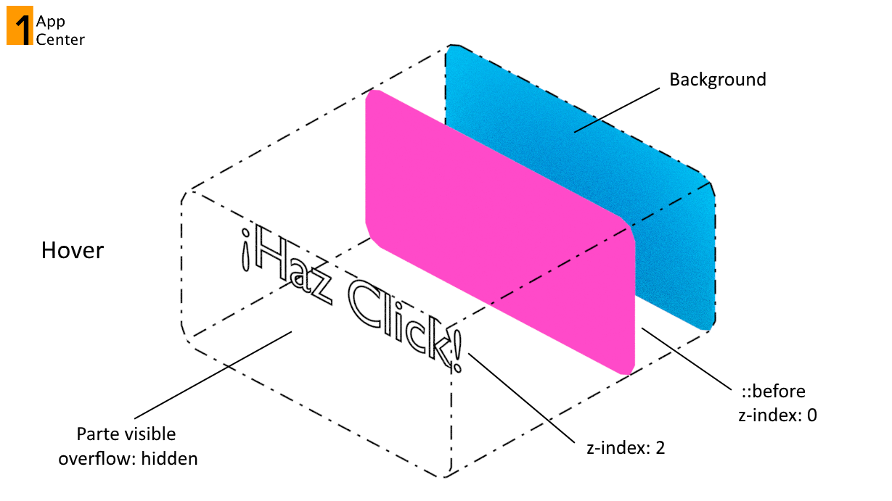
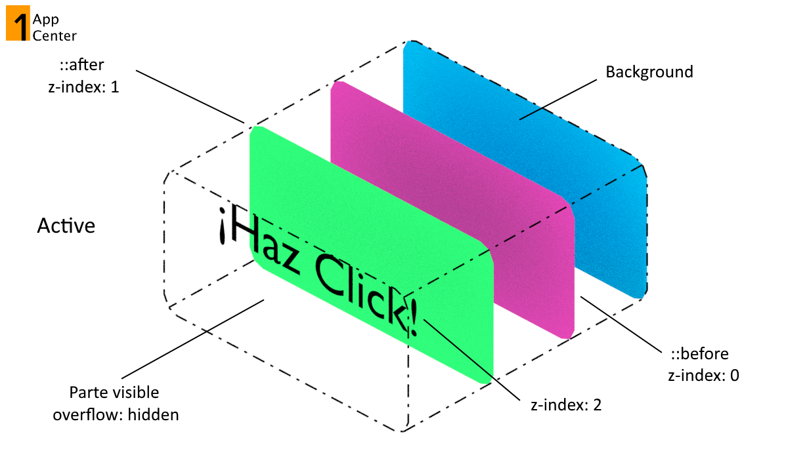

# Botón de colores
publicado: 23 de enero de 2019

## Descripción gráfica de la estructura del botón

### Estructura por default

### Estructura en estado Hover
Cuando el mouse pase sobre el botoón se muestra el primer circulo.

### Estructura en estado Active
Cuando se haga click se muestra el segundo circulo.

Ve más en One App Center
[Instagram](https://instagram.com/oneappcenter)
